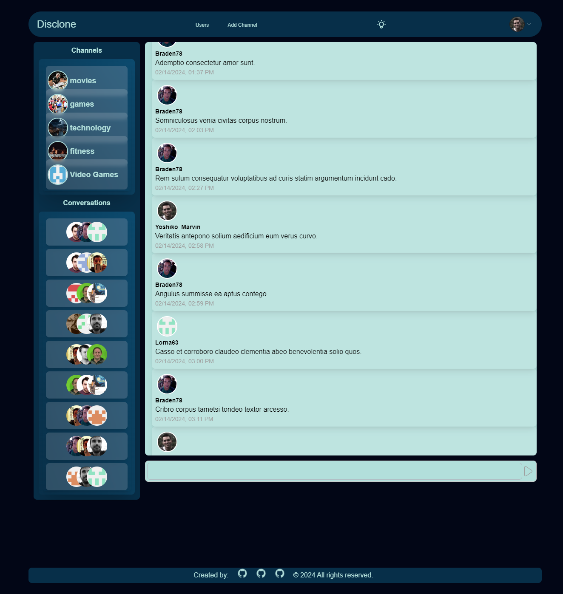

# DisClone

This project was created by a team of three developers, including myself. The other team member's GitHub profiles are linked below:

> https://github.com/Devon2731

> https://github.com/underwoodjo

This repository was created as a part of the University of Richmond's Bootcamp, Project 3 Challenge. The goal of this project was to create a full-stack application using the MERN stack.

Our team decided to create a chat application to learn more about websockets and how to implement them in a full-stack application, while increasing our knowledge of React and MongoDB, and how to make our applications more secure.

The application is called DisClone, and it is a chat application that allows users to create an account, create and/or join a channel, and create or join conversations with other users using the application.

Key features of the application include:

-    User authentication - The application uses JWT tokens to authenticate users and keep them logged in, even if they close the browser, if they don't clear their cookies. All passwords are hashed using bcrypt. Two tokens are used, one for the user's session and one for the user's refresh token. Each are stored in the cookies of the user's browser, with the refresh token being stored in an httpOnly cookie for added security. The server handles the authentication and authorization of the user when any request is made to the server. There's also a "empty" request to the server that causes the client to have their token refreshed if their browser stays open. Each of the mutations and queries in the GraphQL schema are protected by a middleware function that checks the user's token and verifies that the user has the correct permissions to access the data.

-    Websockets - The application uses websockets to allow users to chat in real-time. When a user sends a message in a channel, the message is sent to the server and then broadcasted to all users who have joined the channel, giving notifications to the users that a new message has been sent with a badge, number indicator, of how many unread messages there are. Further development of this application will integrate more of the websocket features.

-    User interface - The application uses React and Material-Tailwind-UI to create a clean and user-friendly interface. The application is responsive and can be used on both desktop and tablet devices. Further development of this application will include more features and a more polished user interface.

-    Database - The application uses MongoDB to store user data, channel data, conversation data, and message data.

The following project requirements were provided for use to meet.

> ## Project Requirements
>
> -    Use React for the front end.`
> -    Use GraphQL with a Node.js and Express.js server.
> -    Use MongoDB and the Mongoose ODM for the database.
> -    Use queries and mutations for retrieving, adding, updating, and deleting data.
> -    Be deployed using Heroku (with data).
> -    Have a polished UI.
> -    Be responsive.
> -    Be interactive (i.e., accept and respond to user input).
> -    Include authentication (JWT).
> -    Protect sensitive API key information on the server.
> -    Have a clean repository that meets quality coding standards (file structure, naming conventions, best practices for class and id naming conventions, indentation, high-quality comments, etc.).
> -    Have a high-quality README (with unique name, description, technologies used, screenshot, and link to deployed application).

## Table of Contents

-    [Installation](#installation)
-    [Usage](#usage)
-    [License](#license)
-    [Contributing](#contributing)
-    [Tests](#tests)
-    [Questions](#questions)

## Installation

No installation is required. This application is deployed and can be accessed at the following link: [DisClone](https://radiant-crag-99170-330c9e6a9c97.herokuapp.com/login)

If you would like to see this application in its development environment, please follow the instructions below.

This application requires Node.js to run. Please visit https://nodejs.org/en/ to download Node.js if it is not already installed on your computer.

This application also requires MongoDB to run. Please visit https://www.mongodb.com/try/download/community to download MongoDB if it is not already installed on your computer.

This application also requires a .env file to store the secret key for the JWT token. Please create a .env file in the root directory of the project and add the following line to the file:

`TOKEN_SECRET=<your_secret_key_here>`

If you are unfamiliar with cloning a repository, please click on the following link to learn: [Github docs | Cloning a repository](https://docs.github.com/en/repositories/creating-and-managing-repositories/cloning-a-repository)

To install this application locally, clone the repository, navigate to its directory in the terminal, and run `npm install` in the command line to install the required dependencies.

The following scripts are available to run in the command line from the root directory of the project:

```json
     "scripts": {
          "start": "node server/server.js",
          "dev": "concurrently \"cd server && npm run watch\" \"cd client && npm run dev\"",
          "install": "cd server && npm i && cd ../client && npm i",
          "build": "cd client && npm run build",
          "format": "prettier --write .",
          "seed": "cd server && npm run seed"
     },
```

Use the following command to start the server and client concurrently: `npm run dev`

The application will be available at the following link: [http://localhost:3000](http://localhost:3000)
The graphql playground will be available at the following link: [http://localhost:3001/graphql](http://localhost:3001/graphql)

## Usage

After navigating to the application you will be brought to the login page and able to click on the link to sign. Feel free to use the following credentials to login and test the application:

```
Username: Yoshiko_Marvin
Password: password

```

The following is a screenshot of the application with messages populated in the chat window.



Other users who are logged in, can join the channel you are in and send messages to the channel. The messages will be broadcasted to all users who have joined the channel and you will be able to see the badge indicator of over the channel avatar, indicating how many unread messages there are.

The application needs further development to include more features like starting a conversation with a user, developing more user customization and expanding the chat features.

## License

This application is licensed under the MIT license. See the following link for more information: https://opensource.org/licenses/MIT

## Contributing

Feel free to contribute to this project! Please fork the repository and create a pull request with your changes.

## Tests

No tests are included in this application.

## Questions

If you have any questions, please contact me at drgstriker@aol.com. You can also visit my GitHub profile at https://github.com/RobSprouse.
